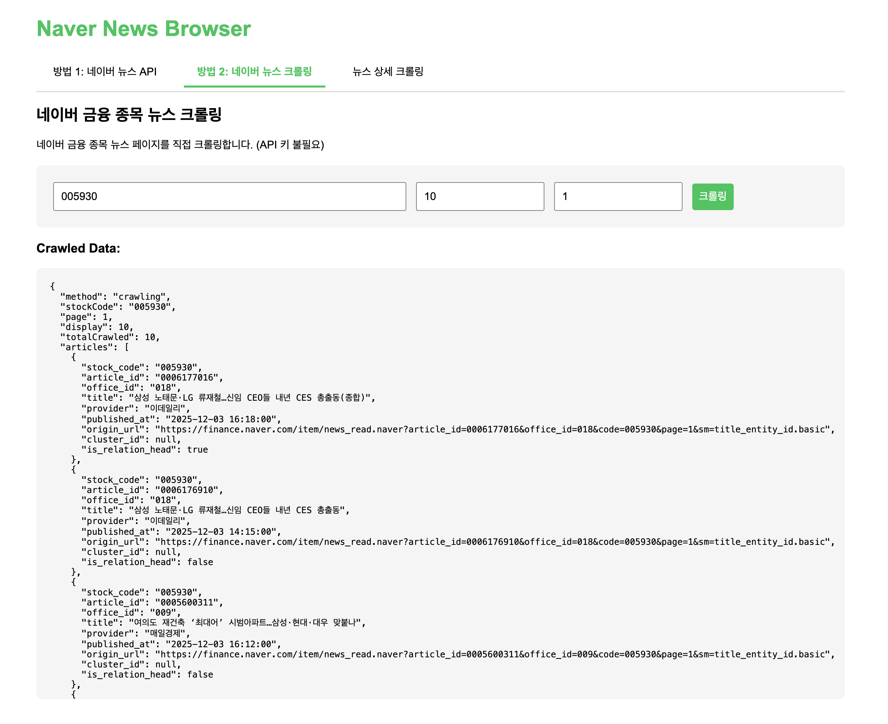

# Naver News Crawler

네이버 뉴스를 검색하고 크롤링하는 Node.js 프로젝트입니다.



> 웹 인터페이스에서 뉴스 검색, 크롤링, 상세 조회를 한 화면에서 테스트할 수 있습니다.

## 주요 기능

### 1. 네이버 뉴스 검색 API
- 키워드로 뉴스 검색
- 정렬 옵션 지원 (유사도순, 최신순)

### 2. 네이버 금융 뉴스 크롤링
- 종목코드로 뉴스 목록 크롤링
- API 키 불필요

### 3. 뉴스 상세 크롤링
- 기사 전체 본문 추출
- 이미지 URL 추출
- 메타데이터 추출 (제목, 언론사, 발행일 등)

## 빠른 시작

### 1. 설치

```bash
npm install
```

### 2. 환경 설정 (선택사항)

뉴스 검색 API를 사용하려면 `.env` 파일 생성:

```env
NAVER_CLIENT_ID=your_client_id_here
NAVER_CLIENT_SECRET=your_client_secret_here
```

> API 키는 [네이버 개발자센터](https://developers.naver.com/main/)에서 발급받을 수 있습니다.

### 3. 실행

**웹 인터페이스로 테스트 (권장)**
```bash
node server.js
```
브라우저에서 http://localhost:3000 접속

**CLI로 테스트**
```bash
npm start              # 네이버 뉴스 API 테스트
node test-crawler.js   # 금융 뉴스 목록 크롤링 테스트
node test-detail-crawler.js  # 뉴스 상세 크롤링 테스트
```

## API 사용법

### 1. 뉴스 검색 API

```javascript
import { searchNaverNews } from './index.js';

const result = await searchNaverNews('삼성전자', 10, 1, 'date');
```

### 2. 금융 뉴스 목록 크롤링

```javascript
import { crawlNaverFinanceNews } from './utils/newsCrawler.js';

const result = await crawlNaverFinanceNews({
  stockCode: '005930',  // 삼성전자
  display: 10,
  page: 1
});
```

### 3. 뉴스 상세 크롤링

```javascript
import { crawlNaverFinanceNewsDetail } from './utils/newsCrawler.js';

const detail = await crawlNaverFinanceNewsDetail(
  'https://finance.naver.com/item/news_read.naver?article_id=0006177016&office_id=018'
);

console.log(detail.title);      // 기사 제목
console.log(detail.content);    // 기사 본문
console.log(detail.images);     // 이미지 URL 배열
```

## REST API 엔드포인트

서버 실행 후 사용 가능한 엔드포인트:

```bash
# 뉴스 검색 (API 키 필요)
GET /api/search?query=삼성전자&display=10&sort=date

# 금융 뉴스 목록 크롤링
GET /api/crawl?query=005930&display=10&page=1

# 뉴스 상세 크롤링
GET /api/crawl/detail?url={뉴스URL}
```

## 프로젝트 구조

```
.
├── index.js                    # 네이버 뉴스 API CLI
├── server.js                   # Express 웹 서버
├── utils/
│   └── newsCrawler.js          # 크롤링 유틸리티
├── test-crawler.js             # 목록 크롤링 테스트
└── test-detail-crawler.js      # 상세 크롤링 테스트
```

## 주의사항

- API 키는 `.env` 파일에 보관하고 Git에 커밋하지 마세요
- 크롤링 기능은 네이버의 웹 페이지 구조에 의존하므로, 페이지 구조 변경 시 수정이 필요할 수 있습니다
- 웹 크롤링 시 적절한 요청 간격을 유지하세요

## 라이선스

ISC
